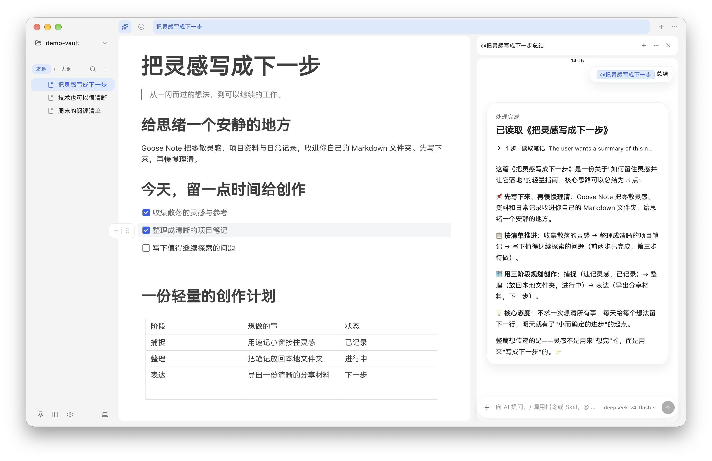
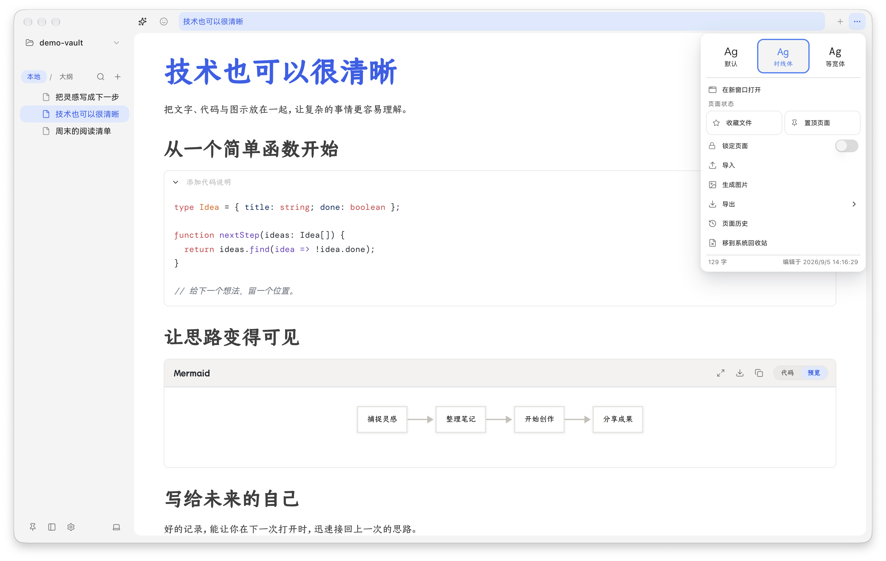

<p align="center">
  
</p>

<h1 align="center">Goose Note</h1>

<p align="center">鹅的笔记 · 给思绪一个安静的地方</p>

<p align="center">
  本地 Markdown、随手速记与 AI，放在同一个写作空间。
</p>

<p align="center">
  <a href="#开始记录">开始记录</a> ·
  <a href="DEVELOP.md">开发文档</a> ·
  <a href="SECURITY.md">安全说明</a>
</p>

<br />

[](docs/showcase/01-writing-ai.png)

<p align="center"><sub>写下想法，慢慢理清。macOS 开发版实拍，点击查看原图。</sub></p>

<br />

## 从自己的文件夹开始

打开一个本地 Markdown 文件夹，就能继续写作。项目资料、阅读摘录与日常记录，都留在自己的文件里。

灵感来得突然时，用独立速记小窗先记下来，再收进笔记。需要梳理思路时，让 AI 引用已有内容、提炼重点，或修改指定段落；原文与对话始终可以并排对照。

<br />

## 让复杂的内容，也容易读

文字、代码、公式和 Mermaid 图示写在一起。用清单推进下一步，用表格整理信息，再将笔记导出为 Markdown、HTML、PDF、Word 或图片。

[](docs/showcase/02-code-and-diagram-user.png)

<sub>macOS 开发版实拍，内容为演示笔记。页面菜单提供字体、历史与导出入口。</sub>

<br />

## 留下内容，也保留余地

- **文件在本地。** 直接使用 Markdown 目录，解除挂载不会删除磁盘文件。
- **重要内容有迹可循。** 页面锁定与历史版本，保留值得回看的节点。
- **按需使用 AI。** 使用在线服务时，请求及引用的笔记内容会发送至所配置的服务。

<br />

## 开始记录

1. 启动 Goose Note，选择「打开本地文件夹」或「新建仓库」。
2. 打开已有 Markdown 文件，或新建一页，写下第一个想法。
3. 需要整理时打开 AI 面板；需要分享时，从页面菜单导出。

<details>
<summary>从源码运行与平台说明</summary>

采用 Electron、React、TypeScript 和 BlockNote。仓库提供 macOS、Windows 和 Linux 的开发与构建命令；上方截图来自 macOS 开发版，安装包可用性以实际提供的构建为准。

```bash
bun install --frozen-lockfile
bun run mac:dev
```

完整运行、验证与打包步骤见 [开发文档](DEVELOP.md)。

</details>

<br />

---

**同系列**　[鹅的书签](https://github.com/eachann1024/goose-mark) · [鹅的监控](https://github.com/eachann1024/goose-monitor) · [鹅的验证](https://github.com/eachann1024/goose-2fa) · [鹅的 Agent](https://github.com/eachann1024/eachann1024)

<details>
<summary>许可与第三方声明 · GPL-3.0-only</summary>

Goose Note 当前代码以 **GNU GPL 第三版（GPL-3.0-only）** 提供，允许商用、修改和再分发，不提供担保。分发受 GPL 约束的应用时，应按 GPL 向接收者提供对应版本源码及必要的构建、安装脚本；单纯内部使用或无副本传递的网络交互通常不属于 GPL 的分发。

详见 [LICENSE](LICENSE)、[第三方声明](THIRD-PARTY-NOTICES.txt) 和 [源码获取说明](SOURCE-CODE.md)。第三方代码与历史 MIT 版本保留其原有许可和版权声明。本项目未添加强制宣传链接或其他定制署名条款。

</details>
