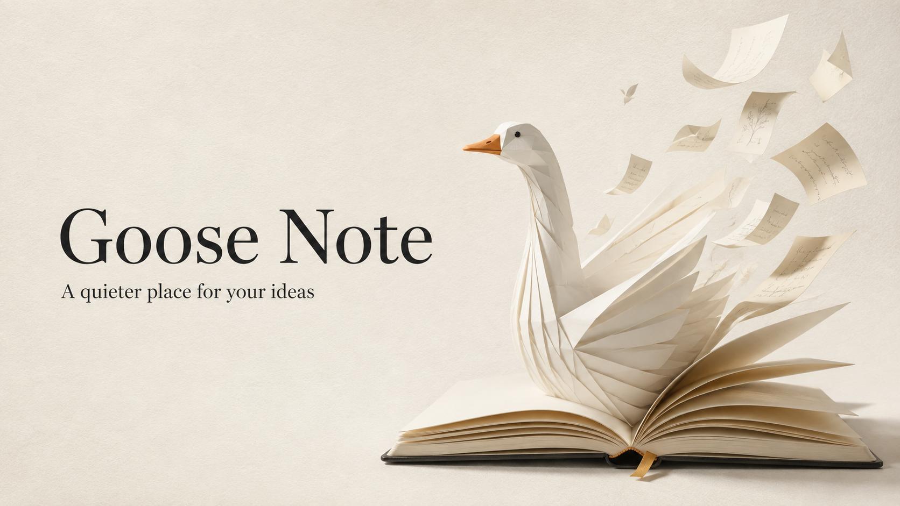

# Goose Note · 鹅的笔记

**把灵感写下来，把下一步留给自己。**

本地优先的桌面笔记应用，把 Markdown 文件夹、独立速记小窗和 AI 助手放进同一个写作空间。

[](docs/showcase/cover.png)

Goose Note 适合用来记录灵感、整理项目资料、写技术笔记和沉淀日常思考。打开一个本地文件夹，就能开始；需要帮助时，让助手结合笔记继续整理。

[项目地址](https://github.com/eachann1024/goose-note-app) · [开发说明](DEVELOP.md) · [安全说明](SECURITY.md)

## 从记录到表达

### 写作与 AI，放在同一个空间

用标题、待办和表格梳理思路，再让 AI 引用笔记、提炼重点。编辑器与对话并排，原文和结果随时对照。

[](docs/showcase/01-writing-ai.png)

### 文字、代码与图示，写在一起

代码高亮与 Mermaid 预览让技术笔记更易读。通过页面菜单调整字体、查看历史与导出内容。

[](docs/showcase/02-code-and-diagram-user.png)

以上两张功能截图使用作者提供的 macOS 开发版原图，可点击查看高清大图；内容为演示笔记。封面为 AI 生成的品牌插画。

## 核心功能

- **文件夹就是记事本**：直接打开本地 Markdown 目录；卸载挂载不会删除磁盘文件。
- **独立速记小窗**：随手记录，再收进主笔记，让零散想法有地方落下。
- **围绕笔记的 AI 助手**：读取与整理笔记，也支持按标题定位内容，修改指定段落。
- **丰富的内容表达**：标题、待办、表格、代码、公式与 Mermaid 图示共同组成笔记。
- **多格式导出**：支持 Markdown、HTML、PDF、Word 和图片，便于归档与分享。
- **页面锁定与历史版本**：保护重要内容，并通过里程碑保留值得回看的版本。

笔记以本地文件为基础。使用在线 AI 服务时，相关请求与引用内容会交由所配置的服务处理。

## 快速上手

1. 启动 Goose Note，选择「打开本地文件夹」或「新建仓库」。
2. 打开已有 Markdown 文件，或新建文件开始记录。
3. 用标题、清单和表格整理内容；技术笔记还可以加入代码与图示。
4. 需要辅助时打开 AI 面板，引用笔记并提出具体要求。
5. 在页面「更多操作」中选择导出格式，把成果带到其他地方。

## 开发与平台

采用 Electron、React、TypeScript 和 BlockNote。仓库提供 macOS、Windows 和 Linux 的开发与构建命令；本次展示在 macOS 开发版完成，安装包可用性以实际提供的构建为准。

```bash
bun install --frozen-lockfile
bun run mac:dev
```

完整运行、验证与打包步骤见 [DEVELOP.md](DEVELOP.md)。

## 同系列

[鹅的书签](https://github.com/eachann1024/goose-mark) · [鹅的监控](https://github.com/eachann1024/goose-monitor) · [鹅的验证](https://github.com/eachann1024/goose-2fa) · [鹅的 Agent](https://github.com/eachann1024/eachann1024)

## 许可

Goose Note 当前代码以 **GNU GPL 第三版（GPL-3.0-only）** 提供，允许商用、修改和再分发，不提供担保。分发受 GPL 约束的应用时，应按 GPL 向接收者提供对应版本源码及必要的构建、安装脚本；单纯内部使用或无副本传递的网络交互通常不属于 GPL 的分发。

详见 [LICENSE](LICENSE)、[第三方声明](THIRD-PARTY-NOTICES.txt) 和 [源码获取说明](SOURCE-CODE.md)。第三方代码与历史 MIT 版本保留其原有许可和版权声明。本项目未添加强制宣传链接或其他定制署名条款。
